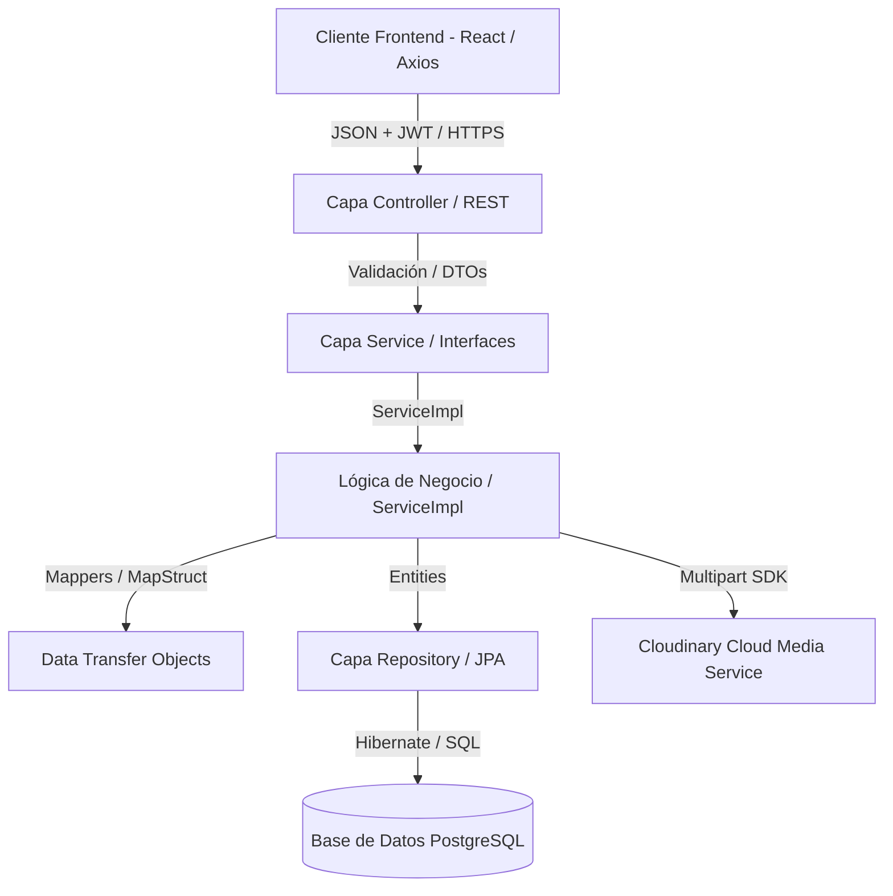
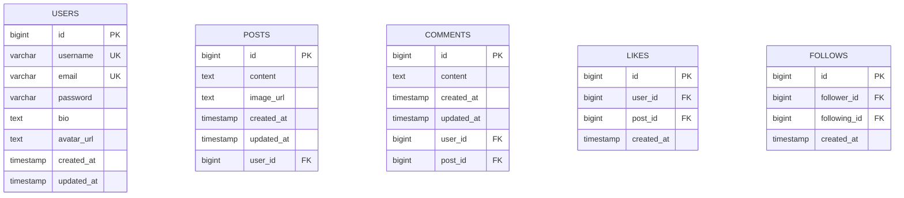

# Documento de Diseño de Software (SDD) - Backend y Especificación del Sistema

**Proyecto:** Connectly  
**Capa:** Servidor / API REST (Spring Boot)  
**Tecnologías:** Java 25, Spring Boot 4.0.6, Spring Security 7, Spring Data JPA, Hibernate, PostgreSQL, MapStruct 1.6.3, Cloudinary  
**Versión:** 1.0  
**Fecha:** Mayo 2026  

---

## 1. ESPECIFICACIÓN GENERAL DEL SISTEMA

### 1.1 Alcance del Sistema
Connectly es una red social diseñada bajo una arquitectura moderna orientada a servicios. Contempla el siguiente alcance funcional:
*   **Gestión de Cuentas y Accesos:** Registro, autenticación de credenciales y administración de sesión sin estado (Stateless) mediante tokens JWT.
*   **Módulo Social de Publicaciones:** Creación de publicaciones conteniendo texto obligatorio e imágenes opcionales cargadas de forma asíncrona, visualización de contenidos en grids/feeds y eliminación controlada de contenido propio.
*   **Módulo de Comentarios y Reacciones:** Publicación, visualización cronológica y borrado de comentarios propios, junto con un sistema reactivo de likes que previene duplicados.
*   **Módulo de Seguimientos (Follows):** Conexión social entre usuarios (seguir y dejar de seguir) con verificación de estado y visualización de listados de seguidores y seguidos.
*   **Feed y Descubrimiento:** Generación de un feed de inicio personalizado que recopila publicaciones de cuentas seguidas en orden cronológico descendente, y una sección de exploración global.
*   **Perfiles de Usuario:** Pantallas públicas de perfiles con contadores reactivos (posts, seguidores y seguidos), cuadrículas de fotos y biografía, así como un gestor de guardados (favoritos) y edición de datos de perfil.

#### Fuera del Alcance:
*   Mensajería y chat interactivo en tiempo real.
*   Notificaciones en vivo (WebSockets/Push).
*   Historias o contenido efímero/temporal.
*   Algoritmos complejos de recomendación basados en Machine Learning.
*   Despliegue y mantenimiento en servidores de producción de alta disponibilidad.

### 1.2 Restricciones del Sistema
*   **Plazo de Desarrollo:** Construcción completa en un término máximo de 5 días.
*   **Arquitectura Frontend:** SPA (Single Page Application) responsiva desarrollada exclusivamente en React.
*   **Arquitectura Backend:** Aplicación en capas lógicas e independientes construida en Java 25 y Spring Boot 4.
*   **Persistencia:** Base de datos relacional PostgreSQL con soporte de borrado en cascada.
*   **Multimedia:** Almacenamiento externo exclusivo de archivos en Cloudinary; el servidor backend no almacena archivos localmente en disco.
*   **Seguridad:** Encriptación irreversible de contraseñas de usuario en base de datos mediante hashing BCrypt.

### 1.3 Tecnologías a Utilizar (Backend & Servidor)
*   **Java 25:** Último estándar de ejecución que incorpora mejoras en rendimiento y carga dinámica de agentes.
*   **Spring Boot 4.0.6:** Framework para el desarrollo y auto-configuración de la API REST de Connectly.
*   **Spring Security 7 & JWT:** Infraestructura de autenticación, CORS y filtros interceptores para tokens JSON Web Tokens.
*   **Spring Data JPA & Hibernate:** Mapeo objeto-relacional y persistencia automatizada.
*   **PostgreSQL:** Motor relacional robusto para el almacenamiento físico.
*   **Cloudinary SDK (1.39.0):** Proveedor cloud de almacenamiento y distribución optimizada de imágenes.
*   **JUnit 5, Mockito & JaCoCo (0.8.13):** Suite de pruebas unitarias y cobertura de código (mínimo exigido: 90% en la capa de servicios lógicos).

### 1.4 Actores del Sistema
*   **Usuario:** Único actor principal interactivo. Es una entidad autenticada que consume la plataforma para registrarse, publicar contenido, interactuar socialmente (likes, comentarios, |favoritos) y gestionar relaciones de seguimiento.

---

### 1.5 Catálogo de Requerimientos del Sistema

#### 1.5.1 Requisitos Funcionales (Matriz RF)

| Código | Requisito Funcional | Prioridad |
| :--- | :--- | :--- |
| **RF01** | El sistema debe permitir registrar un nuevo usuario con nombre de usuario único, correo electrónico único y contraseña cifrada. | Alta |
| **RF02** | El sistema debe permitir al usuario iniciar sesión con su correo electrónico y contraseña, devolviendo un token JWT. | Alta |
| **RF03** | El sistema debe permitir al usuario cerrar sesión y limpiar sus credenciales locales. | Alta |
| **RF04** | El sistema debe permitir al usuario autenticado actualizar su biografía y foto de avatar. | Media |
| **RF05** | El sistema debe permitir al usuario autenticado crear una publicación con texto obligatorio e imagen opcional cargada en Cloudinary. | Alta |
| **RF06** | El sistema debe permitir al usuario autenticado eliminar únicamente sus propias publicaciones creadas. | Alta |
| **RF07** | El sistema debe mostrar al usuario autenticado un feed con las publicaciones más recientes de las cuentas que sigue, en orden cronológico descendente. | Alta |
| **RF08** | El sistema debe mostrar una página de exploración con las publicaciones más recientes de todos los usuarios de la plataforma. | Media |
| **RF09** | El sistema debe permitir visualizar el perfil público de cualquier usuario con su información, posts, y contadores de seguidores y seguidos. | Alta |
| **RF10** | El sistema debe permitir al usuario autenticado dar like o quitar el like a una publicación de forma controlada. | Alta |
| **RF11** | El sistema debe permitir al usuario autenticado agregar comentarios en cualquier publicación del feed o explorar. | Alta |
| **RF12** | El sistema debe permitir al usuario autenticado eliminar únicamente sus propios comentarios. | Media |
| **RF13** | El sistema debe permitir al usuario autenticado seguir a otro usuario registrado. | Alta |
| **RF14** | El sistema debe permitir al usuario autenticado dejar de seguir a un usuario que sigue actualmente. | Alta |
| **RF15** | El sistema debe permitir buscar perfiles de usuarios de forma dinámica y predictiva en el Sidebar filtrando por coincidencia parcial de texto. | Alta |
| **RF16** | El sistema debe permitir al usuario guardar publicaciones de forma privada y consultarlas en una pestaña dedicada de su perfil utilizando almacenamiento local. | Media |
| **RF17** | El sistema debe mostrar una barra superior (StoriesBar) con los avatares de los usuarios seguidos como accesos rápidos a sus perfiles. | Baja |
| **RF18** | El sistema debe mostrar sugerencias de perfiles dinámicas en la barra lateral del feed, descartando usuarios ya seguidos y al usuario activo. | Media |
| **RF19** | El sistema debe mostrar una vista modal detallada (Overlay) para inspeccionar imágenes completas sin recorte y agregar comentarios sobre la publicación. | Alta |

#### 1.5.2 Requisitos No Funcionales (Matriz RNF)

| Código | Requisito No Funcional | Categoría |
| :--- | :--- | :--- |
| **RNF01** | Las contraseñas de los usuarios deben almacenarse de forma cifrada en PostgreSQL utilizando el algoritmo hash BCrypt. | Seguridad |
| **RNF02** | Todos los endpoints REST (excepto registro e inicio de sesión) deben estar protegidos por Spring Security mediante autenticación JWT. Las peticiones no autorizadas deben retornar HTTP 401. | Seguridad |
| **RNF03** | Un usuario autenticado no debe poder modificar ni eliminar recursos que pertenecen a otros. Intentar hacerlo debe retornar HTTP 403 Forbidden. | Seguridad |
| **RNF04** | El sistema debe responder a las peticiones REST en un tiempo menor a 3 segundos bajo condiciones normales de uso. | Rendimiento |
| **RNF05** | El backend debe seguir una arquitectura por capas estrictas (Controller, Service, Repository, Entity), aislando la lógica de negocio de los transportadores. | Arquitectura |
| **RNF06** | El sistema debe contar con pruebas unitarias lógicas (JUnit 5 + Mockito) que validen los escenarios correctos y fallidos de la capa Service. | Calidad |
| **RNF07** | El backend debe alcanzar un porcentaje de cobertura de código mínimo del 90% medido mediante JaCoCo sobre las clases de la capa Service. | Calidad |
| **RNF08** | El frontend debe ser responsivo y garantizar completa usabilidad en navegadores web modernos (Chrome, Firefox, Safari, Edge). | Usabilidad |
| **RNF09** | Las imágenes persistidas en Cloudinary deben ser legibles mediante enlaces HTTPS públicos sin requerir tokens adicionales. | Disponibilidad |

---

## 2. DISEÑO DEL SISTEMA (BACKEND)

### 2.1 Arquitectura del Servidor
El backend de Connectly está desarrollado bajo una **Arquitectura en Capas Limpias**. Esto aísla las responsabilidades lógicas y permite acoplar capas a través de contratos específicos (Interfaces).

---

### 2.2 Diseño de la Base de Datos

El motor relacional **PostgreSQL** aloja cinco entidades físicas estrechamente relacionadas con integridad referencial garantizada.

#### 2.2.1 Esquema Relacional de Base de Datos (Mermaid ERD)

#### 2.2.2 Diccionario de Datos Físicos

##### Tabla: `users`
Representa al usuario registrado en Connectly, conteniendo datos de perfil y credenciales.
*   `id` (BIGINT, PK, AUTO_INCREMENT): Identificador único secuencial de usuario.
*   `username` (VARCHAR(50), NOT NULL, UNIQUE): Nombre único en la red.
*   `email` (VARCHAR(100), NOT NULL, UNIQUE): Correo electrónico para acceso.
*   `password` (VARCHAR(255), NOT NULL): Hash de seguridad generado mediante BCrypt.
*   `bio` (TEXT, NULL): Descripción personal del perfil.
*   `avatar_url` (TEXT, NULL): Enlace HTTPS público del avatar cargado en Cloudinary.
*   `created_at` (TIMESTAMP, NOT NULL): Fecha de registro, administrada automáticamente por `@PrePersist`.
*   `updated_at` (TIMESTAMP, NULL): Fecha de actualización de datos de perfil (`@PreUpdate`).

##### Tabla: `posts`
Representa el contenido o publicación creada por un usuario de la plataforma.
*   `id` (BIGINT, PK, AUTO_INCREMENT): Identificador único secuencial de la publicación.
*   `content` (TEXT, NOT NULL): Texto redactado obligatorio.
*   `image_url` (TEXT, NULL): URL pública de la imagen de Cloudinary.
*   `created_at` (TIMESTAMP, NOT NULL): Fecha de creación.
*   `updated_at` (TIMESTAMP, NULL): Fecha de modificación.
*   `user_id` (BIGINT, FK → `users.id`, ON DELETE CASCADE): Usuario propietario del post.

##### Tabla: `comments`
Representa la contribución de texto que realiza un usuario en relación a una publicación.
*   `id` (BIGINT, PK, AUTO_INCREMENT): Identificador secuencial único de comentario.
*   `content` (TEXT, NOT NULL): Texto redactado.
*   `created_at` (TIMESTAMP, NOT NULL): Registro de creación cronológica.
*   `updated_at` (TIMESTAMP, NULL): Registro de modificación.
*   `user_id` (BIGINT, FK → `users.id`, ON DELETE CASCADE): Autor del comentario.
*   `post_id` (BIGINT, FK → `posts.id`, ON DELETE CASCADE): Publicación que aloja el comentario.

##### Tabla: `likes`
Almacena las reacciones de los usuarios sobre las publicaciones existentes.
*   `id` (BIGINT, PK, AUTO_INCREMENT): Identificador de la reacción.
*   `user_id` (BIGINT, FK → `users.id`, ON DELETE CASCADE): Usuario que dio like.
*   `post_id` (BIGINT, FK → `posts.id`, ON DELETE CASCADE): Publicación reaccionada.
*   `created_at` (TIMESTAMP, NOT NULL): Fecha de registro de la reacción.

##### Tabla: `follows`
Registra la relación asimétrica de seguimiento entre dos perfiles sociales.
*   `id` (BIGINT, PK, AUTO_INCREMENT): Identificador de la relación.
*   `follower_id` (BIGINT, FK → `users.id`, ON DELETE CASCADE): Usuario origen del seguimiento.
*   `following_id` (BIGINT, FK → `users.id`, ON DELETE CASCADE): Usuario destino (seguido).
*   `created_at` (TIMESTAMP, NOT NULL): Fecha en que se estableció el enlace de seguimiento.

---

### 2.3 Especificación de la API REST (Endpoints por Módulos)

Toda la comunicación de Connectly se realiza a través de peticiones HTTPS sin estado que intercambian datos formateados exclusivamente en JSON (excepto multipart/form-data para cargas multimedia).

#### 2.3.1 Módulo de Autenticación (`/api/auth`)
*   **POST `/api/auth/register`**
    *   *Descripción:* Registra un usuario nuevo.
    *   *Request:* `RegisterRequest` `{ username, email, password }`
    *   *Response:* `AuthResponse` `{ token, user: UserResponse }` (HTTP 201 Created).
*   **POST `/api/auth/login`**
    *   *Descripción:* Valida credenciales e inicia sesión.
    *   *Request:* `LoginRequest` `{ email, password }`
    *   *Response:* `AuthResponse` `{ token, user: UserResponse }` (HTTP 200 OK).

#### 2.3.2 Módulo de Usuarios (`/api/users`)
*   **GET `/api/users`** -> Obtiene todos los usuarios. (HTTP 200 OK).
*   **GET `/api/users/{id}`** -> Obtiene el perfil público de un usuario. (HTTP 200 OK / 404).
*   **GET `/api/users/{id}/posts`** -> Lista las publicaciones creadas por ese usuario. (HTTP 200 OK).
*   **GET `/api/users/{id}/followers`** -> Lista los seguidores de un perfil. (HTTP 200 OK).
*   **GET `/api/users/{id}/following`** -> Lista las cuentas que sigue un perfil. (HTTP 200 OK).
*   **PUT `/api/users/{id}`** (Protegido) -> Actualiza biografía y username. (HTTP 200 OK / 403).
*   **PUT `/api/users/{id}/avatar`** (Protegido, Multipart) -> Actualiza avatar en Cloudinary. (HTTP 200 OK / 400 / 403).

#### 2.3.3 Módulo de Publicaciones (`/api/posts`)
*   **GET `/api/posts/feed`** (Protegido) -> Obtiene publicaciones cronológicas de usuarios seguidos. (HTTP 200 OK).
*   **GET `/api/posts/explore`** -> Descubrimiento de publicaciones recientes de todo el sistema. (HTTP 200 OK).
*   **GET `/api/posts/{id}`** -> Detalle completo de una publicación. (HTTP 200 OK / 404).
*   **POST `/api/posts`** (Protegido) -> Crea una publicación de texto. (HTTP 201 Created).
*   **POST `/api/posts/upload`** (Protegido, Multipart) -> Crea publicación con imagen en Cloudinary. (HTTP 201 Created / 400).
*   **DELETE `/api/posts/{id}`** (Protegido) -> Elimina un post propio. (HTTP 204 No Content / 403).

#### 2.3.4 Módulo de Comentarios
*   **GET `/api/posts/{postId}/comments`** -> Obtiene comentarios de un post. (HTTP 200 OK).
*   **POST `/api/posts/{postId}/comments`** (Protegido) -> Agrega comentario. (HTTP 201 Created).
*   **DELETE `/api/comments/{id}`** (Protegido) -> Elimina comentario propio. (HTTP 204 No Content / 403).

#### 2.3.5 Módulo de Likes
*   **POST `/api/posts/{postId}/likes`** (Protegido) -> Da like. Lanza error 409 si ya existe. (HTTP 201 Created / 409).
*   **DELETE `/api/posts/{postId}/likes`** (Protegido) -> Quita like. (HTTP 204 No Content).
*   **GET `/api/posts/{postId}/likes/count`** -> Obtiene total de likes. (HTTP 200 OK).

#### 2.3.6 Módulo de Seguimiento (Follows)
*   **POST `/api/follows/{userId}`** (Protegido) -> Sigue a un usuario. Impide autoseguimiento (HTTP 400). (HTTP 201 Created).
*   **DELETE `/api/follows/{userId}`** (Protegido) -> Deja de seguir. (HTTP 204 No Content).
*   **GET `/api/follows/{userId}/status`** (Protegido) -> Verifica si el usuario autenticado sigue al perfil. (HTTP 200 OK).

---

### 2.4 Arquitectura Detallada de Clases y Capas del Backend

El backend se organiza bajo una distribución lógica estricta estructurada en 8 capas de código diferenciadas:

#### 1. Capa Entity (Modelos JPA de Base de Datos)
Mapean las tablas físicas de la base de datos PostgreSQL utilizando JPA/Hibernate:
*   `User.java`: Representa al usuario. Gestiona la biografía, el avatar y las colecciones `@OneToMany` hacia posts, comentarios, likes, followers y following con opciones `cascade = CascadeType.ALL` y `orphanRemoval = true`.
*   `Post.java`: Representa un post. Guarda la relación `@ManyToOne` hacia su creador, y colecciones de comentarios y likes asociados.
*   `Comment.java`: Almacena las relaciones `@ManyToOne` hacia el post y hacia el autor.
*   `Like.java`: Registra la relación entre un usuario y un post de reacción.
*   `Follow.java`: Registra las claves foráneas hacia el seguidor (`follower`) y hacia el seguido (`following`).

#### 2. Capa Repository (Acceso a Base de Datos)
Interfaces que extienden `JpaRepository` para automatizar consultas nativas y JPA:
*   `UserRepository`: Consultas personalizadas como `findByUsername` y `findByEmail`.
*   `PostRepository`: Operaciones CRUD y consultas ordenadas por fecha.
*   `CommentRepository`: Recupera comentarios por ID de publicación.
*   `LikeRepository`: Cuenta y valida relaciones de likes.
*   `FollowRepository`: Valida estados de seguimiento entre dos IDs lógicos de usuarios.

#### 3. Capa DTO (Data Transfer Objects)
Modelos inmutables para el transporte seguro de información a través del protocolo HTTP.
*   **Request DTOs (Peticiones con Validación):**
    *   `RegisterRequest.java`: Contiene validaciones como `@NotBlank`, `@Email` y `@Size(min = 6)` para el registro seguro de credenciales.
    *   `LoginRequest.java`: Credenciales básicas (`email`, `password`) de acceso.
    *   `UpdateProfileRequest.java`: Datos actualizables (`username`, `bio`).
    *   `PostRequest.java` / `CommentRequest.java`: Textos obligatorios.
*   **Response DTOs (Respuestas de la API):**
    *   `AuthResponse.java`: Devuelve el token JWT y el DTO de perfil de usuario.
    *   `UserResponse.java` / `PostResponse.java` / `CommentResponse.java` / `LikeResponse.java`: Estructuran la salida previniendo exponer datos delicados de base de datos como hashes de contraseñas.

#### 4. Capa Service (Lógica de Negocio Desacoplada)
Estructurada bajo el patrón de interfaces y clases de implementación (`ServiceImpl`):
*   `AuthService` / `AuthServiceImpl`: Registro y validaciones de unicidad de usuario/email, hashing de contraseñas con BCrypt, y autenticación JWT.
*   `UserService` / `UserServiceImpl`: Consulta de perfiles, relaciones y edición multimedia interactuando con Cloudinary.
*   `PostService` / `PostServiceImpl`: Creación, feed ordenado e integración asíncrona de almacenamiento de imágenes.
*   `CommentService` / `CommentServiceImpl`: Inserción de comentarios.
*   `LikeService` / `LikeServiceImpl`: Registro de me gusta con validación de conflictos (duplicados).
*   `FollowService` / `FollowServiceImpl`: Control de conexiones sociales e impedimento de autoseguimiento.
*   `CloudinaryService` / `CloudinaryServiceImpl`: Módulo conector que encapsula el SDK oficial de Cloudinary.
*   `JwtService`: Generador y validador de tokens JWT.

#### 5. Capa Controller (Endpoints REST)
Exponen las rutas HTTP y manejan los códigos de respuesta del sistema:
*   `AuthController`, `UserController`, `PostController`, `CommentController`, `LikeController`, `FollowController`.

#### 6. Capa Security (Seguridad y JWT)
Componentes del ecosistema de **Spring Security 7**:
*   `JwtService.java`: Módulo de firma y validación criptográfica de JSON Web Tokens.
*   `JwtAuthenticationFilter.java`: Filtro interceptor HTTP que extrae el token JWT del header `Authorization`, valida sus firmas y establece el contexto de seguridad.
*   `CustomUserDetails.java` & `CustomUserDetailsService.java`: Acoplan la entidad del dominio `User` al almacén interno de Spring Security.
*   `SecurityUtils.java`: Método estático utilitario para recuperar de forma limpia la identidad del usuario logueado.
*   `SecurityConfig.java`: Configuración del filtro central, habilitación de CORS, bloqueo de CSRF y declaración del inyector de BCrypt.

#### 7. Capa Exception (Manejo de Errores Unificado)
*   `GlobalExceptionHandler.java`: Anotada con `@RestControllerAdvice`. Captura excepciones lógicas de aplicación y las convierte en JSON estructurados (`ErrorResponse`) con códigos HTTP correctos.
*   `ResourceNotFoundException.java` -> HTTP 404.
*   `BadRequestException.java` / `IllegalArgumentException.java` -> HTTP 400.
*   `ConflictException.java` -> HTTP 409 (likes repetidos o nombres de usuario duplicados).

#### 8. Capa Mapper (Mapeo Rápido con MapStruct 1.6.3)
Interfaces que autogeneran código de mapeo inmutable en tiempo de compilación:
*   `UserMapper.java`, `PostMapper.java`, `CommentMapper.java`, `LikeMapper.java`.
