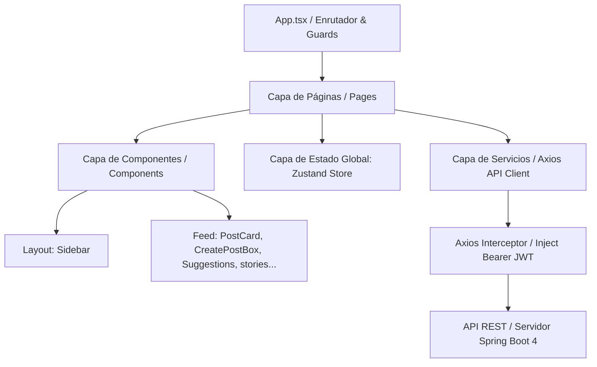

# Documento de Diseño de Software (SDD) - Frontend

**Proyecto:** Connectly  
**Capa:** Cliente (Single Page Application)  
**Tecnologías Clave:** React 19, Vite, TypeScript, Zustand 5.0.3, Tailwind CSS 4.3.0, Axios 1.7.9, Lucide Icons 0.475.0  
**Versión:** 1.0  
**Fecha:** Mayo 2026

---

## 1. ESPECIFICACIÓN GENERAL DEL CLIENTE

### 1.1 Alcance del Cliente

El frontend de Connectly es una SPA (Single Page Application) responsiva que consume exclusivamente los endpoints REST provistos por el servidor Spring Boot. Su alcance abarca:

- **Gestión de Accesos:** Páginas dedicadas de login y registro con validación en caliente de formularios.
- **Navegación e Interacción Principal:** Visualización del feed e interactividad en publicaciones (creación con texto y fotos, borrado de posts propios, likes y comentarios).
- **Gestión de Perfiles:** Visualización de perfiles, pestañas para alternar vistas de posts y favoritos guardados localmente, seguimiento e informes de contadores lógicos (seguidores, seguidos, posts).
- **Componentes Reutilizables Premium:** Sidebar fija con buscador predictivo, barra de atajos de usuarios seguidos (StoriesBar), panel dinámico de sugerencias de conexión (SuggestionsPanel) y modales avanzadas de visualización detallada.

### 1.2 Restricciones del Sistema (Frontend)

- **React SPA:** Desarrollado íntegramente como una Single Page Application utilizando React 19 para garantizar reactividad de componentes y optimización del DOM virtual.
- **Estilo y Responsividad:** Estética premium, limpia y responsiva (soporte nativo para Chrome, Firefox, Edge, Safari) construida con Tailwind CSS v4.
- **Persistencia de Sesiones:** El token JWT se almacena de forma segura en `localStorage` y se inyecta de manera automática en las cabeceras de peticiones salientes.

---

## 2. ARQUITECTURA DEL CLIENTE (DISEÑO DE ALTO NIVEL)

El frontend está estructurado de manera modular y altamente cohesiva, separando la capa de presentación de la capa de control de servicios y la gestión de estados globales:



### Descripción de Módulos:

1.  **Capa de Enrutamiento (`App.tsx`):** Utiliza `react-router-dom` v7 para definir el enrutamiento y las barreras de protección (_guards_) de acceso a páginas protegidas basadas en el estado del token de sesión.
2.  **Capa de Páginas (`/src/pages`):** Componentes contenedores de alto nivel que representan las pantallas de la plataforma y administran sus flujos de datos.
3.  **Capa de Componentes (`/src/components`):** Elementos visuales reutilizables agrupados por contexto (`layout` para barras globales, `feed` para visualizaciones del feed e interacciones sociales).
4.  **Capa de Estado Global (`/src/store`):** Utiliza Zustand 5 para administrar la sesión y credenciales de forma reactiva y persistente.
5.  **Capa de Utilidades y Servicios (`/src/lib`):** Aloja al cliente HTTP Axios y sus interceptores de inyección automática de cabeceras seguras.

---

## 3. DISEÑO DEL ESTADO GLOBAL Y CLIENTE HTTP

### 3.1 Tienda de Autenticación (`authStore.ts`)

Zustand gestiona el estado global de la sesión de manera ligera y rápida, persistiendo la información clave del perfil y el token en local storage.

#### Interfaz del Estado (`AuthState`):

```typescript
interface AuthState {
  user: any | null; // Perfil público del usuario conectado
  token: string | null; // Token de sesión JWT
  isAuthenticated: boolean; // Indicador rápido de estado de acceso
  setAuth: (user: any, token: string) => void; // Inyecta sesión y token al loguearse
  updateUser: (user: any) => void; // Modifica datos de perfil localmente
  logout: () => void; // Limpia el almacenamiento de sesión
}
```

Al invocar `logout`, el sistema elimina las referencias de `token` y `user` en el `localStorage` del navegador y reestablece los estados locales a `null` y `false`.

### 3.2 Cliente HTTP e Interceptores (`axios.ts`)

Axios encapsula las llamadas al backend asegurando que todo endpoint protegido reciba el JWT de forma transparente para el programador de la UI:

```typescript
import axios from "axios";

const api = axios.create({
  baseURL: "http://localhost:8081/api",
  headers: {
    "Content-Type": "application/json",
  },
});

// Interceptor de Peticiones
api.interceptors.request.use((config) => {
  const token = localStorage.getItem("token");
  if (token) {
    config.headers.Authorization = `Bearer ${token}`;
  }
  return config;
});

export default api;
```

---

## 4. DISEÑO DETALLADO DE COMPONENTES REUTILIZABLES

Los elementos visuales de Connectly están diseñados bajo la filosofía de **UI Optimista**, actualizando estados e interfaces de manera instantánea y aplicando rollbacks transparentes en segundo plano si la API REST reporta errores de comunicación.

### 4.1 Catálogo de Componentes Compartidos

#### 1. `Sidebar`

Barra de navegación lateral persistente en todas las vistas autenticadas.

- **Funcionalidades:** Aloja los enlaces a Inicio, Explorar, Crear y Perfil, y gestiona el perfil del usuario activo en la parte inferior para habilitar el cierre de sesión rápido.
- **Buscador Integrado:** Incorpora una caja de búsqueda dinámica que precarga usuarios mediante `GET /api/users` al enfocarse por primera vez. Realiza un filtrado interactivo inmediato sobre nombres de usuario (`username`) o correos electrónicos (`email`) a medida que el usuario escribe, habilitando un menú desplegable de navegación hacia perfiles con auto-cierre dinámico.

#### 2. `PostCard`

Tarjeta representativa de una publicación individual en el feed o perfil.

- **Funcionalidades:** Despliega el avatar circular, nombre del autor, tiempo transcurrido (formato amigable), contenido textual e imagen opcional cargada en Cloudinary.
- **Acciones:** Aloja botones reactivos para dar/quitar likes, guardar en favoritos y abrir la modal detallada.
- **Saved Posts (Favoritos):** El botón de Bookmark interactúa localmente con `localStorage` bajo la clave `saved_posts_${userId}`, persistiendo las publicaciones seleccionadas por el usuario autenticado de forma local y privada.

#### 3. `CreatePostBox`

Caja interactiva fija en la parte superior del feed de inicio.

- **Funcionalidades:** Área de texto auto-expandible (`auto-grow`) y botón de publicación con loaders interactivos.
- **Selector de Emojis Tabulado:** Menú flotante con categorías de emojis (Caras 😊, Gestos 👍, Varios ❤️) que se insertan de forma exacta en la posición del cursor de texto.
- **Gestor Multimedia:** Selector de archivos con FileReader integrado para previsualizaciones rápidas y botones de descarte. Valida en caliente restricciones de tipo (`image/*`) y peso (máximo 10 MB).

#### 4. `PostDetailModal`

Modal responsiva superpuesta estilo overlay de gran escala.

- **Funcionalidades:** Abre una vista de pantalla dividida al hacer clic en el texto o la sección de comentarios de un post.
- **Aspect Ratio Preservation:** Para imágenes verticales u horizontales, renderiza una doble capa visual: una capa trasera difuminada con desenfoque de relleno (_blurred background_) y una capa frontal enfocada con las proporciones originales del archivo multimedia.
- **Feed de Comentarios en Vivo:** Consulta la API en vivo para desplegar los comentarios con scroll dinámico suave hacia abajo (`scrollIntoView({ behavior: 'smooth' })`) ante nuevos aportes.

#### 5. `SuggestionsPanel`

Panel lateral fijo de recomendación social.

- **Funcionalidades:** Consulta los perfiles de la red, verifica su estado de seguimiento y extrae hasta 5 perfiles recomendados a los que el usuario activo aún no sigue.
- **Acciones:** Botón de seguimiento rápido optimista (remueve al usuario del panel una vez seguido de forma automática tras un breve intervalo de éxito).

#### 6. `StoriesBar`

Fila horizontal ubicada en la parte superior del feed de inicio.

- **Funcionalidades:** Muestra los avatares circulares de las cuentas que el usuario autenticado sigue. Sirven como atajos visuales interactivos que redirigen directamente al perfil público seleccionado al hacer clic sobre ellos.

#### 7. `UserAvatar`

Componente modular encargado del renderizado de fotos de perfil.

- **Funcionalidades:** Mapea las URLs de Cloudinary de forma controlada y expone una foto por defecto (`/images/avatar_user.png`) si el perfil no cuenta con una imagen propia registrada, manteniendo la consistencia de la UI.

#### 8. `LikeButton`

Botón de reacción social interactivo.

- **Funcionalidades:** Implementa el patrón **Optimistic UI**. Al hacer clic, cambia de color de forma inmediata (activo/inactivo) e incrementa o decrementa la cifra del contador visible. Ejecuta las peticiones HTTP (`POST`/`DELETE` `/posts/{id}/likes`) en segundo plano y revierte instantáneamente los estados locales si la petición al servidor falla.

#### 9. `FollowButton`

Botón de control de seguimiento bidireccional.

- **Funcionalidades:** Implementa **Optimistic UI**. Cambia su estilo (colores opacos o brillantes) y texto ("Seguir" / "Siguiendo") instantáneamente al hacer clic, ejecutando peticiones asíncronas en segundo plano hacia la base de datos de follows y revirtiendo cambios ante desconexiones.

---

## 5. DISEÑO DE PÁGINAS Y RUTAS (VISTAS PRINCIPALES)

La aplicación web de Connectly se compone de 6 vistas o páginas funcionales principales:

1.  **Página de Login (`Login.tsx`):** Formulario interactivo de acceso con validación en caliente y redirección automática hacia el Feed en caso de token activo.
2.  **Página de Registro (`Register.tsx`):** Formulario de registro de cuentas con validación de requisitos de campos (formato de correo, contraseña segura mayor a 6 caracteres).
3.  **Página de Feed (`Feed.tsx`):** Pantalla principal que renderiza la barra de historias (`StoriesBar`), la caja creadora (`CreatePostBox`), la lista secuencial cronológica de publicaciones de usuarios seguidos (`PostCard`), la barra de sugerencias (`SuggestionsPanel`) y cargadores asíncronos dinámicos.
4.  **Página de Explorar (`Explore.tsx`):** Grid visual que despliega las publicaciones recientes de todos los usuarios del sistema ordenadas cronológicamente para el descubrimiento de nuevo contenido en Connectly.
5.  **Página de Perfil (`Profile.tsx`):** Muestra el avatar grande, biografía, contadores activos y una interfaz interna de pestañas para alternar entre la cuadrícula de publicaciones propias y la lista privada de publicaciones guardadas por el usuario.
6.  **Página de Edición de Perfil (`EditProfile.tsx`):** Formulario para actualizar el nombre de usuario, biografía e interactuar de forma directa con la carga de avatar en Cloudinary mediante el endpoint multipart.
